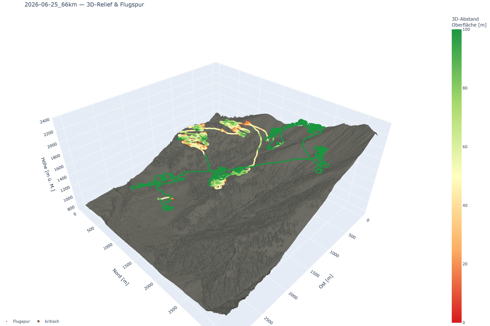
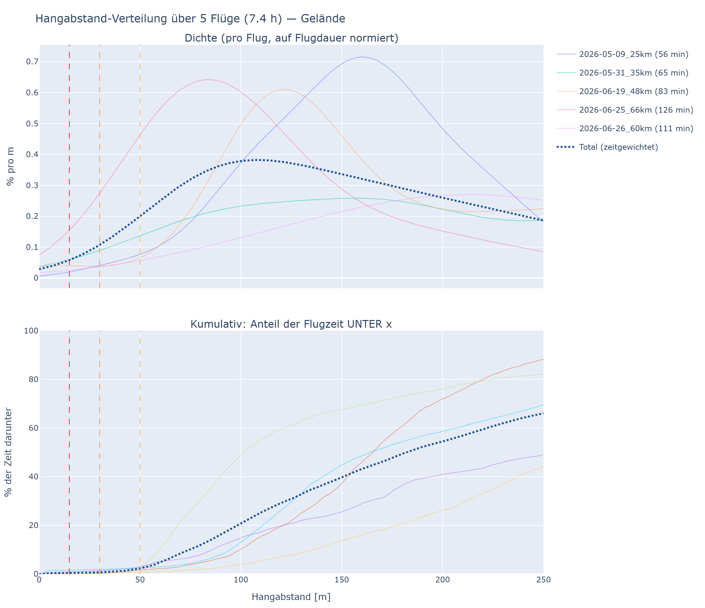
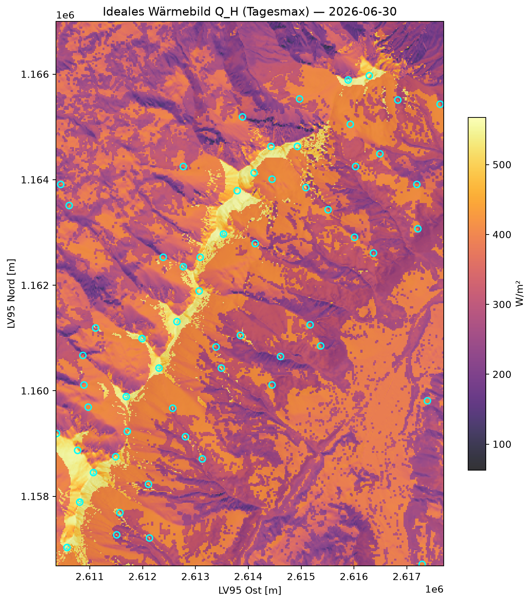
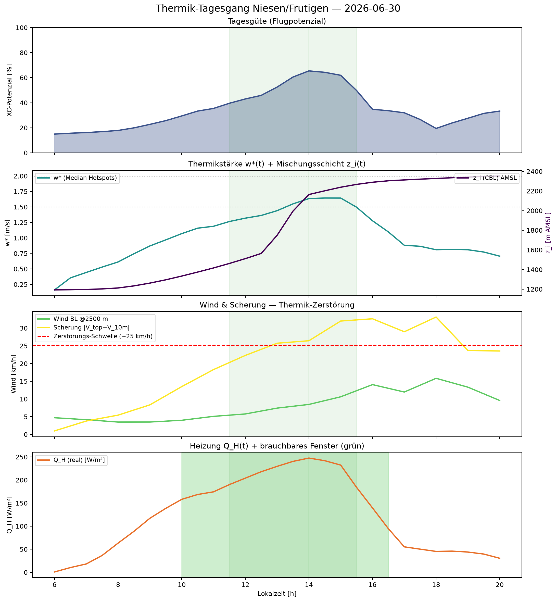
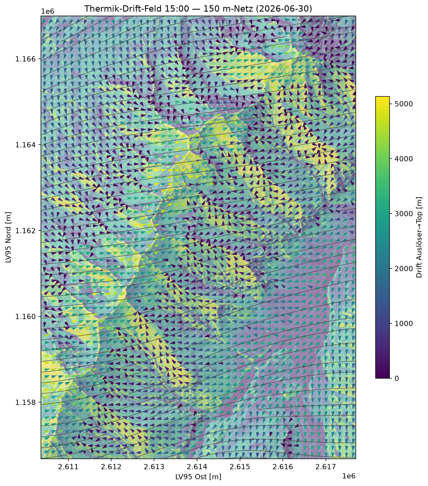

# paragliding-tools

Zwei Werkzeuge für Gleitschirmflieger in der Schweiz, beide auf freien Geodaten und der
hochaufgelösten swisstopo-Topografie aufgebaut:

1. **Hangabstand** — der minimale **3D-Geländeabstand** entlang eines IGC-Flugtracks
   (inkl. Wald/Gebäude, GPS-Unsicherheit, Verteilung über die Flugzeit).
2. **Thermik-/Meteo-Prognose** — **solargetriebene Thermik-Modellierung**: reale
   Einstrahlung im Tagesverlauf → Wärmestrom → Hotspots, Grenzschicht (w\*/z_i) und
   driftende Thermik-Säulen, validiert gegen eigene Flüge und thermal.kk7.ch.

Alle Geo-/Wetterdaten werden **zur Laufzeit** aus offenen Quellen geholt (nichts Grosses im Repo).

---

## 1 · Hangabstand (terrainclearance)

Für **jeden Punkt eines Flugtracks** den kürzesten 3D-Abstand zum Gelände **und** zur
Vegetations-/Gebäudeoberfläche — findet kritische Annäherungen, schätzt die GPS-bedingte
Unsicherheit (Monte-Carlo) und wertet die Verteilung über die Flugzeit aus.

| 3D-Relief + Flugspur (nach Hangabstand eingefärbt) | Flugvergleich: Zeit-in-Hangabstand (Dichte + kumulativ) |
|---|---|
|  |  |

```bash
python analyze.py examples/data/igc/2026-06-25_66km.igc
```

Erzeugt interaktive, offline öffenbare HTML: Karte (Track nach Abstand eingefärbt), 3D-Relief
mit Flugspur, Barogramm mit Unsicherheitsband, Abstands-Verteilung.
**Beispiel-Ausgaben:** [`examples/output/terrainclearance/`](examples/output/terrainclearance/)
(interaktive `…_map.html` + 3D-/Vergleichs-PNGs + `risk_over_time.png`) · **Details & Methodik:**
[`docs/terrainclearance.md`](docs/terrainclearance.md).

## 2 · Thermik-/Meteo-Prognose (thermalmodel)

Modelliert die Sonneneinstrahlung auf der 3D-Topografie über den Tag, leitet den fühlbaren
Wärmestrom (Thermik-Antrieb), Hotspots, deren Stärke/Decke und driftende Thermik-Säulen ab —
und beantwortet **wann starten, wo sind die Spots, wie stark verschiebt/zerstört der Wind sie**.

| ideales Wärmeeintragsbild (Tagesmax) | „Wann starten?" — Thermik-Tagesgang |
|---|---|
|  |  |



*Thermik-Drift um 15 Uhr (150 m-Netz) — wie stark der Wind die aufsteigenden Säulen verschiebt/schert.*

```bash
python thermal.py --kml examples/data/domain_niesen_frutigen.kml --skip-plume
```

**Beispiel-Ausgaben:** [`examples/output/thermalmodel/`](examples/output/thermalmodel/)
(`hotspots.html`, PNGs) · **Pipeline & Entscheidungen:** [`src/thermalmodel/README.md`](src/thermalmodel/README.md)
und das ADR-Journal [`docs/thermalmodel-journal.md`](docs/thermalmodel-journal.md).

---

## Installation (Python 3.11+)

```bash
python -m venv .venv
# Windows:  .venv\Scripts\python.exe -m pip install -e .[thermal]
# macOS/Linux:  .venv/bin/pip install -e .[thermal]
```

`rasterio`/`pyproj` bringen GDAL/PROJ als Wheel mit — kein separates GIS-Setup nötig. Ohne
`[thermal]` läuft der Hangabstand-Teil; das Extra zieht `pvlib`/`metpy`/`scikit-image` für die
Thermik-Modellierung nach. Tests: `python -m pytest tests -q`.

## Datenquellen & Lizenzen

Zur Laufzeit geholt, je unter eigener Lizenz mit Quellenpflicht — vollständige Liste mit den
**wörtlich geforderten Quellenangaben** in [`ATTRIBUTION.md`](ATTRIBUTION.md):

- **swissALTI3D / swissSURFACE3D** (Relief) — `©swisstopo`
- **Waldmischungsgrad LFI** (Landcover) — BAFU/WSL, opendata.swiss
- **Payerne-Radiosonde / ICON-CH** — `Quelle: MeteoSchweiz`, CC BY 4.0
- **Open-Meteo** (Zugang ICON/ERA5) — `Weather data by Open-Meteo.com`, CC BY 4.0;
  zugrunde **DWD ICON** und **Copernicus ERA5** (je CC BY 4.0)
- **thermal.kk7.ch** (Validierung) — CC **BY-NC-SA** 4.0 (nur abgeleitete Metriken, keine Rohdaten/Tiles im Repo)

## Lizenz

- **Code:** Apache-2.0 — siehe [`LICENSE`](LICENSE) / [`NOTICE`](NOTICE).
- **Doku, Abbildungen, beschriebene Methodik** (README, `docs/`, ADR-Journal): **CC BY 4.0** —
  wer auf diesen Ideen/Texten aufbaut, nennt bitte den Autor und zitiert das Repo
  ([`CITATION.cff`](CITATION.cff)).

## Repo-Struktur

```
analyze.py / thermal.py        Launcher der beiden Use-Cases
src/terrainclearance/          Hangabstand-Paket
src/thermalmodel/              Thermik-Modellierung (+ validation/)
meteo/                         Payerne-Radiosonde (Datenquelle für Phase B)
examples/data/                 Beispiel-Inputs (5 Tracks + Domain-KML)
examples/output/               kuratierte Beispiel-Ergebnisse
docs/                          Methodik (terrainclearance.md) + ADR-Journal
tests/                         pytest-Suite
```
