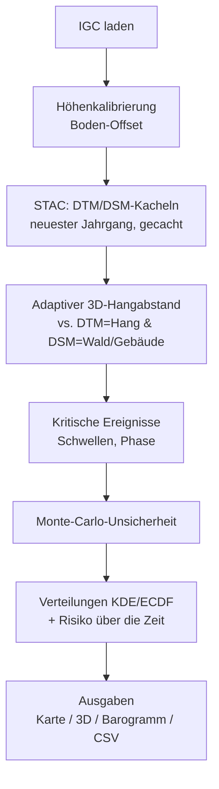
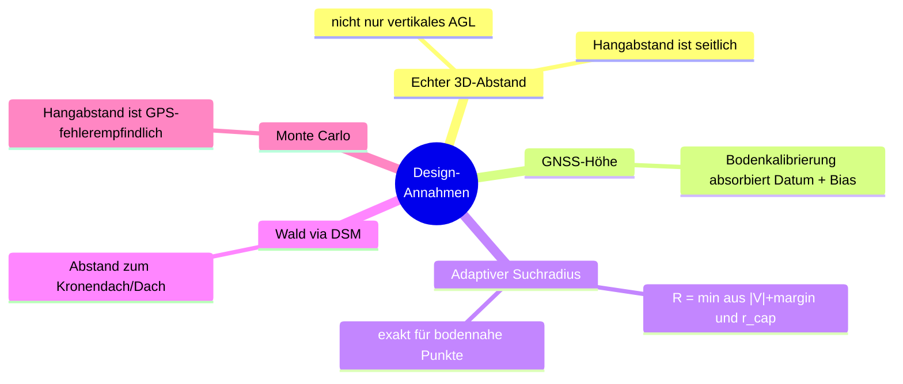

# Gleitschirm-Hangabstandsanalyse

Berechnet **für jeden Punkt einer IGC-Flugspur den minimalen 3D-Abstand zum Gelände**
auf Basis der höchstaufgelösten swisstopo-Höhenmodelle und findet damit **kritische
Flugmomente mit geringem Hangabstand**. Berücksichtigt **Wald/Vegetation und
Gebäude** (Abstand zum Kronendach, nicht nur zum nackten Boden), schätzt die
**GPS-bedingte Unsicherheit** des Hangabstands (Monte Carlo) und wertet die **Verteilung
über die Flugzeit** sowie die **Risikoentwicklung über mehrere Flüge** aus.

Funktioniert für jeden Flug innerhalb des swisstopo-Abdeckungsgebiets (Schweiz); die
Beispielspuren liegen im Berner Oberland.

---

## Datenquellen (swisstopo, kostenlos)

- **swissALTI3D** – Geländemodell (DTM, nackter Boden), 0.5 m –
  <https://www.swisstopo.admin.ch/de/hoehenmodell-swissalti3d>
- **swissSURFACE3D Raster** – Oberflächenmodell (DSM, inkl. Vegetation & Gebäude), 0.5 m –
  <https://www.swisstopo.admin.ch/de/hoehenmodell-swisssurface3d-raster>

Kacheln werden automatisch passend zum Flug über die **STAC API** geladen (nur die
Umgebung der Flugspur), unter `cache/` zwischengespeichert und über Flüge derselben Region
hinweg wiederverwendet. Für jede Kachel wird der **neueste Jahrgang** genommen (z. B.
swissALTI3D 2025 statt 2019). Ein manueller Download ist **nicht** nötig.

## Installation (Windows, Python 3.11+)

```powershell
python -m venv .venv
.venv\Scripts\python.exe -m pip install -e .
```

Kein separates GDAL/PROJ nötig – `rasterio` und `pyproj` liefern die Binär-Bibliotheken
als Wheels mit. (`kaleido` wird nur für statische PNG-Exporte benötigt und ist nicht
erforderlich.)

## Verwendung

```powershell
# Einzelflug (mitgelieferte Beispielspur)
.venv\Scripts\python.exe analyze.py examples\data\igc\2026-06-25_66km.igc

# Alle Flüge in einem Ordner (Saisonanalyse)
.venv\Scripts\python.exe analyze.py examples\data\igc

# Schneller ohne das Monte-Carlo-Band
.venv\Scripts\python.exe analyze.py examples\data\igc --no-uncertainty
```

### Wichtige Optionen

| Option | Wirkung (Default) |
|---|---|
| `--resolution {0.5\|2}` | Rasterauflösung (0.5 m; DSM bleibt immer 0.5 m) |
| `--r-cap <m>` | Max. 3D-Suchradius (300) |
| `--calibration {auto\|gnss\|pressure\|none}` | Höhenquelle/Kalibrierung (auto) |
| `--no-uncertainty` / `--sigma-h <m>` / `--sigma-v <m>` | Monte-Carlo-Band aus / GPS-σ (an / 3 / 5) |
| `--no-3d` / `--surface3d-model {dsm\|dtm}` | 3D-Plot aus / Reliefmodell (an / dsm) |
| `--surface3d-max-dim <n>` / `--surface3d-darkness <0..1>` | 3D-Auflösung / Dunkelheit (700 / 0.7) |
| `--surface3d-color {clearance\|p05\|mean}` | 3D-Spurfärbung (clearance) |
| `--timezone <tz>` / `--no-proj-network` | Zeitzone (Europe/Zurich) / PROJ-Netzwerk aus |

## Ausgaben (`output/`)

| Datei | Inhalt |
|---|---|
| `*_map.html` | Interaktive Karte: Spur eingefärbt nach 3D-Hangabstand, kritische Stellen markiert. |
| `*_3d.html` | Interaktiver **3D-Plot**: mattes, dunkles Hillshade-Relief + drehbare Flugspur, eingefärbt nach Hangabstand; MC-Band im Hover. |
| `*_barogram.html` | Höhenprofil (Flughöhe / Gelände / Oberfläche) + Hangabstand-über-Zeit mit Schwellen, Ereignissen und **Unsicherheitsband** (p05–p95). |
| `*_clearance_kde.html` | **Zeitverteilung** über den Hangabstand: Dichte + **kumulativ** ("% der Zeit unter X m"), Gelände und Wald. |
| `aggregate_clearance_kde.html` | **Aggregat über mehrere Flüge** (Dichte + kumulativ; pro Flug + Mittel + zeitgewichtetes Total), normiert auf die Flugdauer. |
| `risk_over_time.html` | **Risiko über die Zeit**: Hangabstands-Perzentile (p05/p10/p25/Median) + Zeitanteil unter den Schwellen pro Flug, chronologisch. |
| `*_points.csv` | Pro Fix alle Werte inkl. MC-Band (Mittel/p05/p95/min/max). |
| `*_events.csv` | Kritische Momente: Zeit, Ort, Stufe, Phase (Flug/Landeanflug), Hangabstände inkl. p05/p95. |
| `*_run.json` | Metadaten: Kachel-Jahrgänge, Kalibrierungs-Offset/-Konfidenz, Transform-Pipeline, MC-σ. |

Alle HTML-Dateien sind **eigenständig** (Plotly inline) und können offline geöffnet werden.

---

## Pipeline



## Methodik

- **3D-Abstand mit adaptivem Suchradius:** Für einen Punkt P und jede Rasterzelle in
  horizontalem Abstand `d` gilt `3D = sqrt(d²+Δz²) ≥ d`. Der vertikale Bodenabstand
  `V = z − ground(x,y)` ist daher eine **obere Schranke** des 3D-Abstands, sodass ein
  Suchradius `R = min(|V|+margin, r_cap)` genügt. Das ist **exakt** für alle bodennahen
  (kritischen) Punkte und sehr schnell; hohe, unkritische Punkte werden grob abgetastet und
  als `clipped` markiert. Berechnet gegen DTM (Hangabstand) **und** DSM (Abstand zum
  Kronendach/Dach). Verifiziert gegen Brute Force und `scipy.cKDTree` (0.0000 m Abweichung
  für unkritische Punkte).
- **Höhenkalibrierung:** Die GNSS-Höhe (`HFALG:GEO`, geoidbezogen) hat einen nahezu
  konstanten Offset (LN02-Datum + GPS-Bias). Ein additiver Offset wird so bestimmt, dass die
  am Boden aufgezeichnete Höhe (vor dem Start / nach der Landung) mit dem DTM übereinstimmt –
  das absorbiert Datum **und** Bias gemeinsam. Bodenerkennung über geglättete
  Geschwindigkeit/Vario.
- **Wald/Vegetation:** separater Abstand zum DSM. Ein Ereignis ist `terrain` oder
  `forest/object`, je nachdem, was näher liegt – so werden bewaldete Steilhänge korrekt als
  kritischer erkannt als der nackte Boden.
- **Kritische Momente:** lokale Minima unterhalb konfigurierbarer Schwellen
  (Gelände 50/30/15 m, Oberfläche 30/15/5 m). Bodenkontakt bei Start/Landung zählt nicht;
  reine Schlussabstiege heißen `landing approach`; die "In-Flight"-Minimumstatistik schließt
  den finalen Landeabstieg aus.
- **GPS-Unsicherheit (Monte Carlo):** Der Hangabstand reagiert empfindlich auf GPS-Fehler
  (in steilem Gelände horizontal ~1:1, vertikal 1:1). Jede Position wird N-mal mit einer
  Normalverteilung (σ_h, σ_v) gestört und gegen denselben Geländepatch berechnet → Mittel,
  p05–p95, min/max. Tiefe Punkte vollständig per MC, deutlich über Grund analytisch
  (σ ≈ σ_v). Das Band ist im Barogramm, in den CSVs und im 3D-Hover eingebettet.
- **Zeitverteilung:** zeitgewichtete KDE des Hangabstands (Dichte + kumulative ECDF) pro
  Flug und als Aggregat über alle Flüge, normiert auf die Flugdauer.
- **Risiko über die Zeit:** pro Flug (chronologisch) die niedrigen Hangabstands-Perzentile
  und der Zeitanteil unter den Schwellen – zeigt, wie sich die Annäherung an das Gelände
  entwickelt.
- **3D-Relief:** monochrome, **matte Schummerung** aus dem DEM (kein Glanz), bewusst
  **dunkel** gehalten, damit die rot→grün-Hangabstandsspur heraussticht und das Relief
  (Runsen/Grate) klar lesbar bleibt; echte Proportionen (`aspectmode='data'`).

## Design-Annahmen



## Entscheidungen & Begründung

Die wichtigsten gemeinsam getroffenen Entscheidungen:

1. **Echter 3D-Abstand statt nur vertikal (AGL).** "Hangabstand" beim Soaren ist seitlich
   definiert; man kann 400 m über dem Talboden und doch 20 m neben einer Wand sein. Der
   vertikale AGL-Wert wird als Nebenprodukt mitgeführt.
2. **Höchste Auflösung (0.5 m)**, wobei nur die Umgebung der Spur geladen + gecacht wird.
   2 m optional für Tempo.
3. **Neuester Kachel-Jahrgang** pro Position ("modernste Modelle"); überschreibbar.
4. **GNSS-Höhe als Quelle** (geoidbezogen, `HFALG:GEO`). Die Druckhöhe ist ISA-bezogen →
   ungeeignet für absolute Höhen. Handy-Tracks (XCTrack) haben Druck = 0, GNSS ist nutzbar.
5. **Bodenkalibrierung statt REFRAME-Höhentransformation:** ein konstanter Offset absorbiert
   das Höhendatum (LN02) und den GPS-Bias gemeinsam. REFRAME diente nur der Prüfung der
   horizontalen Genauigkeit.
6. **Horizontale Transformation lokal mit pyproj** (WGS84→LV95): gegen die swisstopo-REFRAME-
   API auf **0.01 m** validiert → kein CHENYX06-Grid nötig (das gilt nur für das alte LV03).
7. **Wald via DSM (swissSURFACE3D)**, getrennt vom nackten Gelände; Ereignisse anhand beider.
8. **Start/Landung nicht als Flugereignis;** Schlussabstiege als `landing approach` markiert
   (statt versteckt) – nichts wird unterdrückt, aber alles korrekt klassifiziert.
9. **Unsicherheit via Monte Carlo** mit σ_h = 3 m, σ_v = 5 m (u-blox; Handy höher),
   N = 80, volles MC unter 80 m Hangabstand, sonst analytisch. Band als p05–p95 (robust) plus
   min/max. **MC auch im 3D** (Hover; optional konservative Färbung nach p05).
10. **Verteilungssicht statt nur einer Momentaufnahme:** zeitgewichtete KDE + kumulative
    ECDF, dazu Risiko-über-Zeit, um Muster über die Saison sichtbar zu machen.
11. **3D matt, dunkel, Schummerung** (nicht glänzend/hell) und Anzeige-Downsampling: volle
    0.5 m über einen ganzen Flug wären ~36 Millionen Punkte und würden jeden Browser
    sprengen; der Default (~4–5 m) lässt sich über `--surface3d-max-dim` erhöhen.
12. **Eigenständiges HTML** (offline öffenbar, ohne Server/Token).
13. **Flugdaten (`source/igc/`) sind versioniert** – konsistent mit den Originalspuren und
    für reproduzierbare Analysen. Können bei Bedarf über `.gitignore` ausgeschlossen werden.

## Genauigkeit & Grenzen

- **GNSS-Höhe:** Handy-Tracks sind vertikal verrauschter als dedizierte Logger (u-blox). Die
  Kalibrierungs-Konfidenz steht in `*_run.json`. Absolute Werte haben eine Unsicherheit von
  einigen Metern – das MC-Band zeigt sie; Hangabstände unter ~5 m nicht überinterpretieren
  (meist Landung/Bodenkontakt).
- **DTM/DSM-Jahrgänge** können sich unterscheiden (DTM oft neuer) → Waldhöhe mit kleinem
  Vorbehalt.
- **`clipped`-Punkte** (Abstand > `r_cap`) sind nicht exakt, aber unkritisch.

## Tests

```powershell
.venv\Scripts\python.exe -m pytest tests -q
```

## Projektstruktur

```
analyze.py                  Einstiegspunkt (python analyze.py source\igc)
src/terrainclearance/
  config.py                 alle Parameter (Schwellen, σ, Auflösung, 3D-Optik …)
  igc_loader.py             IGC lesen, Höhenquelle pro Datei wählen
  geo.py                    WGS84 -> LV95 (pyproj, cm-genau)
  stac.py                   STAC-Abfrage, Kachelauswahl (neuester Jahrgang)
  tiles.py                  Download/Cache, Mosaik, bilineares Sampling, Patches
  terrain.py                adaptiver 3D-Abstand (DTM & DSM)
  calibrate.py              Bodenerkennung + Höhen-Offset
  critical.py               Ereignisse, Schweregrad, Phase (Flug/Landeanflug)
  uncertainty.py            Monte-Carlo-Unsicherheitsband
  distribution.py           Zeitverteilung (KDE/ECDF), Aggregat, Risiko-über-Zeit
  report.py                 Karte, 3D, Barogramm, CSV/JSON
  pipeline.py               Orchestrierung pro Flug
  cli.py                    Kommandozeile
tests/                      pytest-Suite
examples/data/igc/          Beispielspuren (5 längste Flüge; eigene Tracks lokal, gitignored)
cache/  output/             generiert (gitignored)
```
