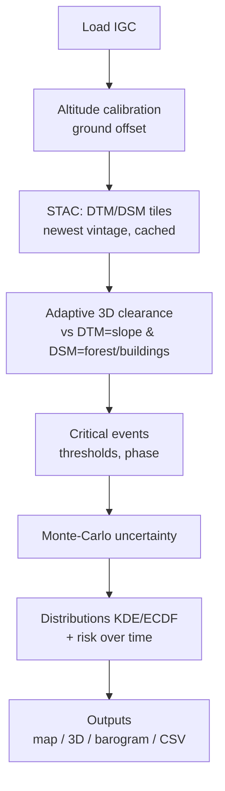
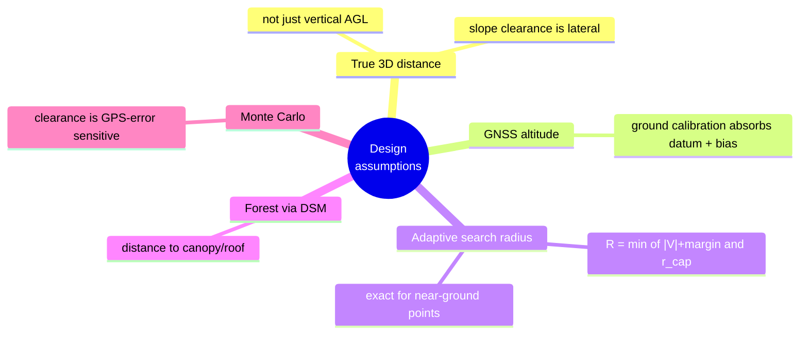

# Paraglider Terrain-Clearance Analysis

Computes, **for every point of an IGC flight track, the minimum 3D distance to the terrain**
based on the highest-resolution swisstopo elevation models, thereby finding **critical
flight moments with little terrain clearance**. Accounts for **forest/vegetation and
buildings** (distance to the tree canopy, not just to the bare ground), estimates the
**GPS-induced uncertainty** of the clearance (Monte Carlo) and evaluates the **distribution
over flight time** as well as the **risk evolution across multiple flights**.

Works for any flight within the swisstopo coverage area (Switzerland); the example tracks
lie in the Bernese Oberland.

---

## Data sources (swisstopo, free)

- **swissALTI3D** – terrain model (DTM, bare ground), 0.5 m –
  <https://www.swisstopo.admin.ch/de/hoehenmodell-swissalti3d>
- **swissSURFACE3D Raster** – surface model (DSM, incl. vegetation & buildings), 0.5 m –
  <https://www.swisstopo.admin.ch/de/hoehenmodell-swisssurface3d-raster>

Tiles are loaded automatically to match the flight via the **STAC API** (only the
track surroundings), cached under `cache/` and reused across flights of the same region.
For each tile the **newest vintage** is taken (e.g. swissALTI3D 2025 instead of 2019).
A manual download is **not** required.

## Installation (Windows, Python 3.11+)

```powershell
python -m venv .venv
.venv\Scripts\python.exe -m pip install -e .
```

No separate GDAL/PROJ needed – `rasterio` and `pyproj` ship the binary libraries
as wheels. (`kaleido` is only needed for static PNG exports and is not required.)

## Usage

```powershell
# Single flight (bundled example track)
.venv\Scripts\python.exe analyze.py examples\data\igc\2026-06-25_66km.igc

# All flights in a folder (season analysis)
.venv\Scripts\python.exe analyze.py examples\data\igc

# Faster without the Monte-Carlo band
.venv\Scripts\python.exe analyze.py examples\data\igc --no-uncertainty
```

### Key options

| Option | Effect (default) |
|---|---|
| `--resolution {0.5\|2}` | Raster resolution (0.5 m; DSM always stays 0.5 m) |
| `--r-cap <m>` | Max. 3D search radius (300) |
| `--calibration {auto\|gnss\|pressure\|none}` | Altitude source/calibration (auto) |
| `--no-uncertainty` / `--sigma-h <m>` / `--sigma-v <m>` | Monte-Carlo band off / GPS σ (on / 3 / 5) |
| `--no-3d` / `--surface3d-model {dsm\|dtm}` | 3D plot off / relief model (on / dsm) |
| `--surface3d-max-dim <n>` / `--surface3d-darkness <0..1>` | 3D resolution / darkness (700 / 0.7) |
| `--surface3d-color {clearance\|p05\|mean}` | 3D track coloring (clearance) |
| `--timezone <tz>` / `--no-proj-network` | Time zone (Europe/Zurich) / PROJ network off |

## Outputs (`output/`)

| File | Content |
|---|---|
| `*_map.html` | Interactive map: track colored by 3D terrain clearance, critical spots marked. |
| `*_3d.html` | Interactive **3D plot**: matte, dark hillshade relief + rotatable flight track, colored by clearance; MC band in the hover. |
| `*_barogram.html` | Altitude profile (flight altitude / terrain / surface) + clearance-over-time with thresholds, events and **uncertainty band** (p05–p95). |
| `*_clearance_kde.html` | **Time distribution** over terrain clearance: density + **cumulative** ("% of time below X m"), terrain and forest. |
| `aggregate_clearance_kde.html` | **Multi-flight aggregate** (density + cumulative; per flight + mean + time-weighted total), normalized to flight duration. |
| `risk_over_time.html` | **Risk over time**: terrain-clearance percentiles (p05/p10/p25/median) + share of time below thresholds per flight, chronological. |
| `*_points.csv` | Per fix all values incl. MC band (mean/p05/p95/min/max). |
| `*_events.csv` | Critical moments: time, location, level, phase (flight/landing approach), clearances incl. p05/p95. |
| `*_run.json` | Metadata: tile vintages, calibration offset/confidence, transform pipeline, MC σ. |

All HTML files are **self-contained** (plotly inline) and can be opened offline.

---

## Pipeline



## Methodology

- **3D distance with adaptive search radius:** For a point P and every raster cell at
  horizontal distance `d`, `3D = sqrt(d²+Δz²) ≥ d` holds. The vertical ground clearance
  `V = z − ground(x,y)` is therefore an **upper bound** on the 3D distance, so a search
  radius `R = min(|V|+margin, r_cap)` suffices. This is **exact** for all near-ground
  (critical) points and very fast; high, uncritical points are sampled coarsely and
  marked `clipped`. Computed against DTM (terrain clearance) **and** DSM (distance to
  canopy/roof). Verified against brute force and `scipy.cKDTree` (0.0000 m deviation for
  uncritical points).
- **Altitude calibration:** The GNSS altitude (`HFALG:GEO`, geoid-referenced) has a nearly
  constant offset (LN02 datum + GPS bias). An additive offset is determined such that the
  altitude recorded on the ground (before launch / after landing) matches the DTM – this
  absorbs datum **and** bias jointly. Ground detection via smoothed speed/vario.
- **Forest/vegetation:** separate distance to the DSM. An event is `terrain` or
  `forest/object`, whichever is closer – so forested steep slopes are correctly recognized
  as more critical than the bare ground.
- **Critical moments:** local minima below configurable thresholds
  (terrain 50/30/15 m, surface 30/15/5 m). Ground contact at launch/landing does not count;
  pure final descents are called `landing approach`; the "in-flight" minimum statistic
  excludes the final landing descent.
- **GPS uncertainty (Monte Carlo):** Terrain clearance reacts sensitively to GPS error
  (in steep terrain horizontally ~1:1, vertically 1:1). Each position is perturbed N times
  with a normal distribution (σ_h, σ_v) and computed against the same terrain patch → mean,
  p05–p95, min/max. Low points fully via MC, well above ground analytically (σ ≈ σ_v).
  The band is embedded in the barogram, in the CSVs and in the 3D hover.
- **Time distribution:** time-weighted KDE of the terrain clearance (density + cumulative
  ECDF) per flight and as an aggregate across all flights, normalized to flight duration.
- **Risk over time:** per flight (chronological) the low terrain-clearance percentiles and
  the share of time below the thresholds – shows how the approach to the terrain evolves.
- **3D relief:** monochrome, **matte hillshade** from the DEM (no glare), deliberately kept
  **dark** so the red→green clearance track stands out and the relief (gullies/ridges)
  stays clearly legible; true proportions (`aspectmode='data'`).

## Design assumptions



## Decisions & rationale

The most important jointly made decisions:

1. **True 3D distance instead of just vertical (AGL).** "Terrain clearance" when soaring is
   defined laterally; you can be 400 m above the valley floor yet 20 m next to a wall. The
   vertical AGL value is carried along as a by-product.
2. **Highest resolution (0.5 m)**, loading + caching only the track surroundings. 2 m
   optional for speed.
3. **Newest tile vintage** per position ("most modern models"); overridable.
4. **GNSS altitude as the source** (geoid-referenced, `HFALG:GEO`). Pressure altitude is
   ISA-referenced → unsuitable for absolute altitudes. Phone tracks (XCTrack) have
   pressure = 0, GNSS is usable.
5. **Ground calibration instead of REFRAME altitude transformation:** a constant offset
   absorbs the altitude datum (LN02) and GPS bias together. REFRAME only served to check
   the horizontal accuracy.
6. **Horizontal transformation locally with pyproj** (WGS84→LV95): validated against the
   swisstopo REFRAME API to **0.01 m** → no CHENYX06 grid needed (that applies only to the
   old LV03).
7. **Forest via DSM (swissSURFACE3D)**, separate from the bare terrain; events based on both.
8. **Launch/landing not as a flight event;** final descents marked as `landing approach`
   (rather than hidden) – nothing is suppressed, but everything is classified correctly.
9. **Uncertainty via Monte Carlo** with σ_h = 3 m, σ_v = 5 m (u-blox; phone higher),
   N = 80, full MC below 80 m clearance, otherwise analytical. Band as p05–p95 (robust) plus
   min/max. **MC also in the 3D** (hover; optionally conservative coloring by p05).
10. **Distribution view instead of just a snapshot:** time-weighted KDE + cumulative ECDF,
    plus risk-over-time, to make patterns over the season visible.
11. **3D matte, dark, hillshade** (not glossy/bright) and display downsampling: full
    0.5 m over an entire flight would be ~36 million points and would blow up any browser;
    the default (~4–5 m) can be increased via `--surface3d-max-dim`.
12. **Self-contained HTML** (openable offline, without server/token).
13. **Flight data (`source/igc/`) is versioned** – consistent with the original tracks and
    for reproducible analyses. Can be excluded via `.gitignore` if needed.

## Accuracy & limits

- **GNSS altitude:** Phone tracks are vertically noisier than dedicated loggers
  (u-blox). Calibration confidence is in `*_run.json`. Absolute values have a few meters of
  uncertainty – the MC band shows them; do not over-interpret clearances below ~5 m
  (usually landing/ground contact).
- **DTM/DSM vintages** may differ (DTM often newer) → forest height with a small caveat.
- **`clipped` points** (distance > `r_cap`) are not exact, but uncritical.

## Tests

```powershell
.venv\Scripts\python.exe -m pytest tests -q
```

## Project structure

```
analyze.py                  Entry point (python analyze.py source\igc)
src/terrainclearance/
  config.py                 all parameters (thresholds, σ, resolution, 3D optics …)
  igc_loader.py             read IGC, choose altitude source per file
  geo.py                    WGS84 -> LV95 (pyproj, cm-accurate)
  stac.py                   STAC query, tile selection (newest vintage)
  tiles.py                  download/cache, mosaic, bilinear sampling, patches
  terrain.py                adaptive 3D distance (DTM & DSM)
  calibrate.py              ground detection + altitude offset
  critical.py               events, severity, phase (flight/landing approach)
  uncertainty.py            Monte-Carlo uncertainty band
  distribution.py           time distribution (KDE/ECDF), aggregate, risk-over-time
  report.py                 map, 3D, barogram, CSV/JSON
  pipeline.py               orchestration per flight
  cli.py                    command line
tests/                      pytest suite
examples/data/igc/          example tracks (5 longest flights; own tracks local, gitignored)
cache/  output/             generated (gitignored)
```
