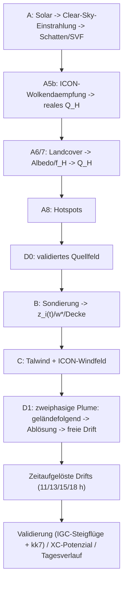
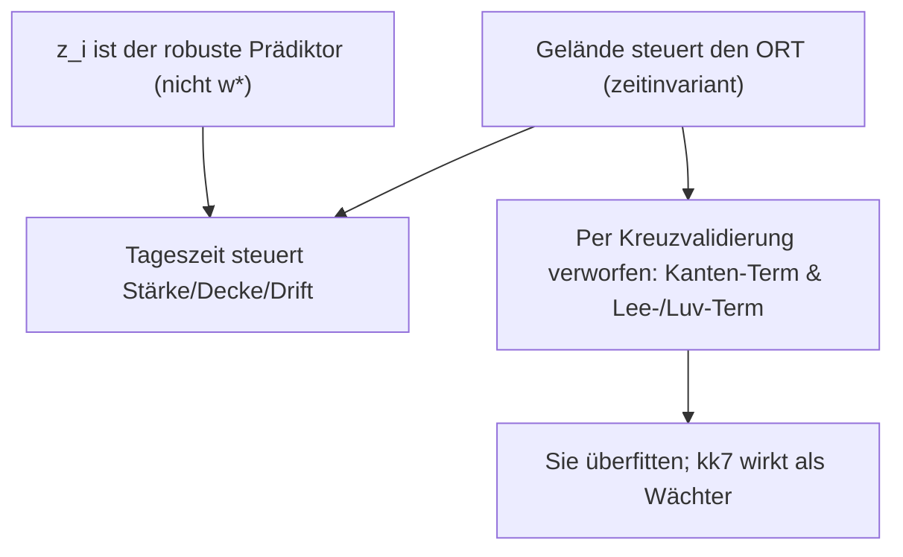

# thermalmodel — solargetriebene Thermikmodellierung (Niesen/Frutigen)

Modelliert die reale solare Einstrahlung über den Tagesverlauf auf der 3D-Topographie, leitet daraus
den fühlbaren Wärmestrom (Thermikantrieb), Thermik-Hotspots, deren Stärke (w*) und Decke sowie
driftende Thermiksäulen ab — validiert gegen die eigenen IGC-Steigflüge des Autors und thermal.kk7.ch.

Schwesterpaket zu `terrainclearance` (Hangabstand) und `meteo` (Payerne-Sondierung) und nutzt
beide nach. **Entscheidungen + Begründung + Annahmen:** siehe [`docs/thermalmodel-journal.md`](https://github.com/Benjamin-Loeffel/paragliding-tools/blob/main/docs/thermalmodel-journal.md) (ADRs).

## Wie das Modell argumentiert (Schritt für Schritt)

Eine solare Thermikprognose wird vom Gelände her aufgebaut — jeder Schritt fügt eine physikalische Zutat hinzu.
Die Abbildungen werden von `python thermal.py` auf dem Beispielgebiet (Niesen/Frutigen) erzeugt.

**1 · Höhenmodell.** Das swissALTI3D-Relief ist die Grundlage: Es entscheidet, wo Hänge zur
Sonne zeigen und wo Grate/Runsen die aufsteigende Luft organisieren.


**2 · Exposition & Steilheit.** Aus dem Relief leiten wir *Aspekt* (in welche Richtung ein Hang zeigt) und *Hangneigung*
(wie steil) ab. Mäßig steile, sonnenzugewandte Hänge erhalten die meiste Energie. Der Aspekt ist zyklisch, daher
das Twilight-Farbrad (N→O→S→W→N).


**3 · Bodenbedeckung auf dem Relief.** Nadelwald, Alpwiese und nackter Fels wandeln Sonnenlicht sehr
unterschiedlich in fühlbare Wärme um (Albedo + Wärmeanteil `f_H`). Das schlägt die Brücke von reiner Geometrie zur realen
Oberfläche.


**4 · Idealer Wärmeeintrag.** Clear-Sky-Einstrahlung × Oberfläche → fühlbarer Wärmestrom `Q_H`, der Thermik-
antrieb, für einen hypothetischen wolkenfreien Tag. Hotspots (cyan) markieren, wo die meiste Energie eingeht.


**5 · Realer Wärmeeintrag = Wolken + Vegetation.** Die ICON-CH-Wolkendämpfung und die Landcover-
Albedo/`f_H` machen aus dem *idealen* Feld das *reale*; die Differenz ist der Wolkenverlust.

| reales Q_H (mit ICON-Wolken) | Wolkenverlust (ideal − real) |
|---|---|
|  |  |

**6 · Wind + Thermik → driftende Plumes.** Das ICON-Windfeld (mehrere Höhen) plus der Auftrieb
(`w*`/`z_i`) advehieren die aufsteigenden Säulen — Thermik steigt nicht gerade nach oben, sie driftet und schert mit der Höhe.


| Thermik-Driftfeld 15:00 | driftende Plumes über dem Relief (≈15:00) |
|---|---|
|  |  |

→ interaktives, zeitaufgelöstes 3D (Schieberegler 11/13/15/18 h): [`d1_plumes_hotspots_3d.html`](assets/thermalmodel/d1_plumes_hotspots_3d.html).

Der Rest dieses README ist die formale Pipeline, die Datenquellen und die Befunde.

## Ausführen

```bash
python thermal.py                 # full pipeline
python thermal.py --skip-plume    # phase A + validation only
python thermal.py --date 2026-06-29 --out output/thermal
```

Erzeugt in `output/thermal/`: Q_H-Wärmebilder (PNG/GeoTIFF, ideal + real + Differenz), kumulative
Energie-Schnappschüsse (11/13/15/18 h, 2D + je ein volles 3D-HTML), D0-Quellwahrscheinlichkeit (3D),
Hotspots (GeoJSON/CSV, + `hotspots_strength.csv` mit w*/Decke), Validierungskarte,
D1-Plumes (3 Varianten als 3D mit **Tageszeit-Schieberegler**), zeitaufgelöste Drifts + Windspuren,
ICON-Wolken-Tagesgang.

## Pipeline



| Phase | Modul | Inhalt |
|---|---|---|
| **A0/A1** | `domain`, `grids`, `terrain_derivs` | KML → 20 m LV95-Gitter; swissALTI3D-DTM → Hangneigung/Aspekt/Krümmung |
| **A2** | `horizon` | Horizontwinkel je Azimut + Sky-View-Faktor (gecacht) |
| **A3–A5** | `solar`, `irradiance` | pvlib-Sonnenstand + Ineichen-Clear-Sky, Einfallswinkel, Schatten → G_clear(t) |
| **A5b** | `nwp` | ICON-CH1-Wolken (Open-Meteo) → Dämpfung f_dir/f_dif/f_ghi → **reales** Q_H-Wärmebild |
| **A6/A7** | `landcover`, `heating` | Wald-Mischungsverhältnis → Albedo/f_H; Q_H = f_H·(1−albedo)·G; Tagesmaximum + Energie |
| **A8** | `hotspots` | Score (Q_H+Konvexität+Aspekt+Hangneigung) → Top-N-Hotspots |
| **D0** | `buoyancy` | validiertes Quellwahrscheinlichkeitsfeld (datengetriebene Gewichtung) |
| **B** | `boundarylayer` | Sondierung → w*/Decke je Hotspot + **z_i(t)-Tagesgang** (CBL-Encroachment) |
| **D1** | `plume` | Zweiphasige Plume: geländefolgend → **Ablösung** (Konvexität/Grat/**Waldkante**) → freie Drift |
| **C** | `valleywind`, `wind` | anabatischer Hangaufwind + ICON-Windfeld (icon_seamless, Druckflächen) |
| **D1-t** | `timedrift` | zeitaufgelöste Drifts (11/13/15/18 h): je 2 Karten + Windspuren (1×5 Höhen, km/h) + **3 Plume-3D-Varianten (hotspots/kk7/grid) als Tageszeit-Schieberegler** |
| **XC** | `xcpotential` | XC-Flugpotenzial (Tagesqualität 0–100 %, soaringmeteo-Stil) |
| **Day** | `daytimeline` | **"Wann starten?"**: w*/z_i/Wind/Scherung/XC über den Tag + Startfenster |
| **Val.** | `validation/` | IGC-Steigflüge + kk7-Hotspots **+ kk7-Heatmap** → verschiebungstolerante Trefferquote/AUC |
| **Retro** | `validation/retrospective` | retrospektive Prognosegüte: eigene Flugtage × historisches Wetter (ERA5/ICON) |

## Datenquellen (alle frei)

- **Relief:** swissALTI3D (swisstopo STAC) — über `terrainclearance`.
- **Wald Nadel-/Laubholz:** BAFU/LFI-Wald-Mischungsverhältnis (10 m, EPSG:2056).
- **Wolken/Strahlung:** ICON-CH1 über Open-Meteo (`models=meteoswiss_icon_ch1`, GRIB-frei).
- **Sondierung:** Payerne (MeteoSchweiz OGD) — über `meteo/`.
- **Validierung:** eigene IGC (`source/igc`) + thermal.kk7.ch (offene REST-API).

## Ergebnisse (Modelltag 2026-06-30; Phase-A-Abbildungen aus dem Referenzlauf 29. Juni)

- **Reales Q_H-Wärmebild:** 99 % bewölkt → Q_H-Tagesenergie ideal→real Median 2669→1467 Wh/m² (~45 % Wolkenverlust).
- **Validierung** (verschiebungstolerant, gegen Zufall): Phase-A-Score AUC **0.66**, **D0 0.71**
  (IGC ≈ kk7 → robust). Lift ×2.2–2.4 @300 m. Die Geländegeometrie trägt das Signal; ein
  Auslöserlinien-Term hatte keine Güte (verworfen).
- **Phase B:** w* Median **1.56 m/s** (max 2.24), Decke ~3200–3600 m AMSL — plausibel.
- **D1 + Phase C:** anabatischer Hangaufwind bringt die Driftrate auf **70 m/min ≈ IGC 74**.
  Ablösemodell: Hotspots sitzen bereits auf konvexen Graten (Ablöse-Offset Median 40 m).
- **Zeitaufgelöst:** Drift 11→15 h steigend (Wind 0.9→1.6 m/s), 18 h Kollaps (schwache Erwärmung);
  Driftpfeile richten sich an den ICON-Windstromlinien aus (visueller Vergleich).
- **XC-Potenzial:** Median 59 %, hohe sonnige Grate ~100 %. soaringmeteo bestätigt unser w*
  (deren fest verdrahteter Median 1.55 = unser 1.56).
- **z_i(t)/"Wann starten":** CBL wächst, durchbricht die Inversion ~13–14 h, w* erreicht Maximum ~14:00 →
  **optimales Startfenster 12–16 h**. Drifts im Tagesgang: kurz am Morgen (flache CBL), max um 15 h, abendlicher Kollaps.
- **kk7-Heatmap** (kontinuierlich, verschiebungstolerant): D0 Spearman 0.26/AUC 0.66 vs. Phase-A-Score
  0.05/0.55; Zeit-Matching (jul_04/07/10) verbessert NICHT → Thermik-*Orte* sind geländegesteuert.
- **Retrospektive Validierung** (`--retrospective`, eigene Flugtage × ERA5/ICON-Historie): z_i-Peak
  bester Prädiktor (Spearman +0.48 vs. Thermik-Top); n=8 → indikativ, mehr Flüge (WeGlide/XContest) ausstehend.
- **Plot-Policy:** nur sequentielle Karten (viridis Default, inferno Energie, cividis Wind), helles
  Relief für Kontrast, Wind in km/h.

Zu den Ausgaben gehören: `qh_*` (Q_H-Wärmebilder), `energy_3d*.html`, `d0_thermal_source_3d.html`,
`d1_plumes_{hotspots,grid,kk7}_3d.html` (3D-Plumes mit **Tageszeit-Schieberegler** 11/13/15/18 h),
`d1_drift_map.png` (Tagesmaximum-Referenz), `drift_HHh_points.png`/`drift_HHh_grid.png`,
`wind_traces_HHh.png`, `xc_potential.png`, `validation_map.png`, `hotspots*.{csv,geojson}`.

## Zentrale Befunde / Argumentation



## Grenzen & Nächstes

- Statischer/kinematischer Proxy: AUC ~0.7 ist literaturtypisch; **>0.8 braucht dynamische
  Prädiktoren** (Tageswetter, Wind, Konvergenz).
- Die Sondierung ist ein Tieflandpunkt (Payerne) → Bergthermik nur näherungsweise.
- ICON/Sondierung nur ~24 h verfügbar → Tagesabrufe gecacht; die Validierung ist klimatologisch.
- **Langfristziel:** Phase C (dedizierte Talwind-Parametrisierung, Lee/Luv), D2 (Massenfluss/CA),
  **D3–D5 LES** (microHH/PALM, WSL2/GPU).

Abhängigkeiten: `pip install -e .[thermal]` (definiert in `pyproject.toml`).
