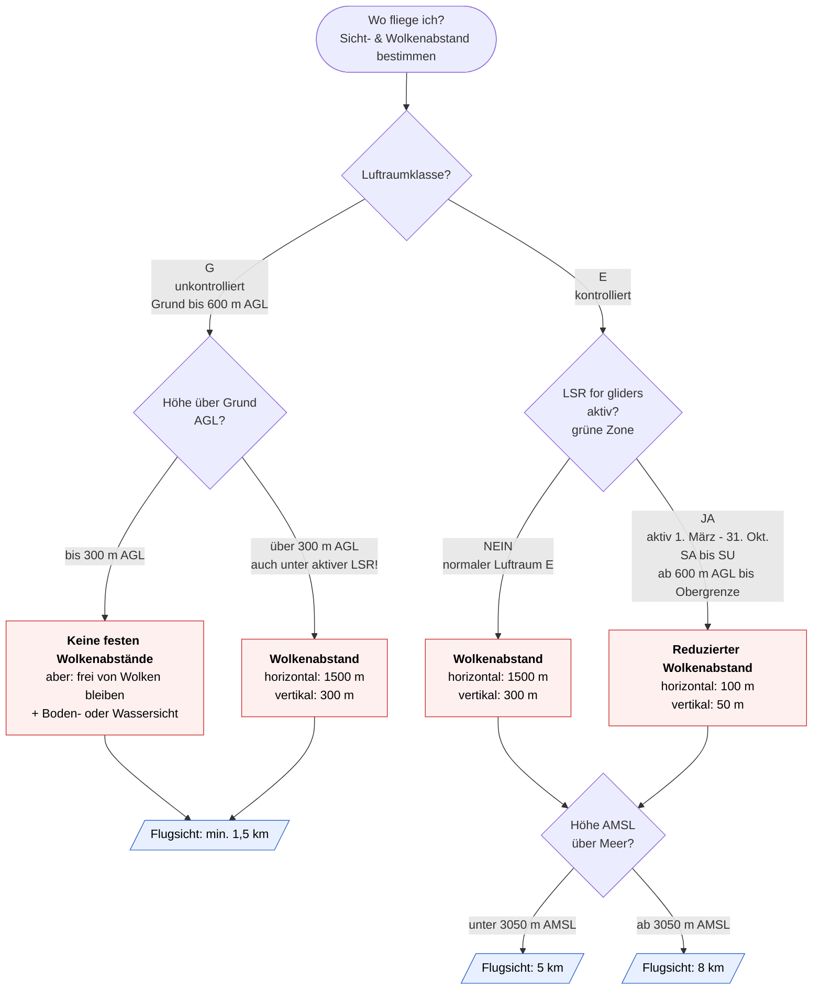

# Sicht & Wolkenabstände – Entscheidungs-Flowchart (SHV/FSVL 2026)

Entscheidungshilfe für die Theorieprüfung Gleitschirmfliegen. Gilt für Hängegleiter/Gleitschirme, die ausschliesslich nach **Sichtflugregeln (VFR)** fliegen.

> **Merke:** Die **Flugsicht** richtet sich nach der **Höhe AMSL** (über Meer) und dem Luftraum.
> Der **Wolkenabstand** richtet sich nach **Höhe AGL** (über Grund), Luftraumklasse und ob eine **LSR for gliders** aktiv ist.

## Zusammenfassung als Tabelle

| Luftraum | Höhe | Flugsicht | Wolkenabstand horizontal | Wolkenabstand vertikal |
|---|---|---|---|---|
| **G** | Grund – 300 m AGL | 1,5 km | – (frei von Wolken, Bodensicht) | – (frei von Wolken, Bodensicht) |
| **G** | 300 – 600 m AGL | 1,5 km | 1500 m | 300 m |
| **E** | unter 3050 m AMSL | 5 km | 1500 m | 300 m |
| **E** | ab 3050 m AMSL | 8 km | 1500 m | 300 m |
| **LSR for gliders** (E) | ab 600 m AGL, unter 3050 m AMSL | 5 km | **100 m** | **50 m** |
| **LSR for gliders** (E) | ab 600 m AGL, ab 3050 m AMSL | 8 km | **100 m** | **50 m** |

## Eselsbrücken / Prüfungs-Fallen

- **Sicht hängt an der Höhe AMSL:** Faustregel „**5 unten – 8 oben**“, Grenze bei **3050 m AMSL** (FL 100).
- **Luftraum G ganz unten (≤ 300 m AGL):** keine Zahlen-Abstände, nur **frei von Wolken + Boden-/Wassersicht** und **1,5 km Sicht**.
- **LSR for gliders = grüne Zone = Erleichterung:** nur die **Wolkenabstände** schrumpfen auf **100 m / 50 m**, die **Sicht bleibt** 5 bzw. 8 km.
- **Absurder Sonderfall:** Unter einer aktiven LSR for gliders gelten zwischen **300 und 600 m AGL** die **grossen** Abstände (1500/300), weil die LSR-Untergrenze seit Okt. 2017 nicht unter 600 m AGL abgesenkt werden darf.
- **Reihenfolge bei Zahlen:** horizontal ist immer die **grössere** Zahl (1500 m bzw. 100 m), vertikal die **kleinere** (300 m bzw. 50 m).
