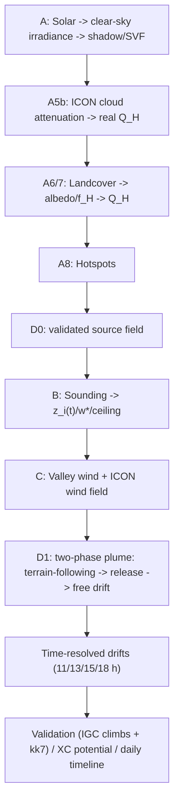
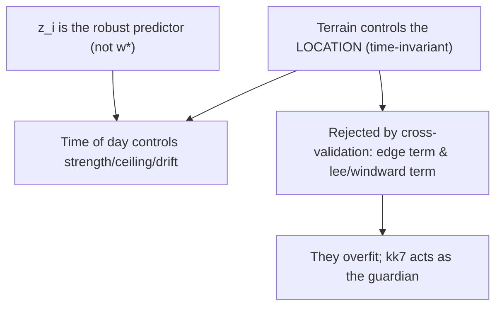

# thermalmodel — solar-driven thermal modelling (Niesen/Frutigen)

Models the real solar irradiance over the course of the day on the 3D topography, derives from it
the sensible heat flux (thermal driver), thermal hotspots, their strength (w*) and ceiling as well as
drifting thermal columns — validated against the author's own IGC climbs and thermal.kk7.ch.

Sister package to `terrainclearance` (terrain clearance) and `meteo` (Payerne sounding) and reuses
both. **Decisions + rationale + assumptions:** see [`docs/thermalmodel-journal.md`](../../docs/thermalmodel-journal.md) (ADRs).

## Running

```bash
python thermal.py                 # full pipeline
python thermal.py --skip-plume    # phase A + validation only
python thermal.py --date 2026-06-29 --out output/thermal
```

Produces in `output/thermal/`: Q_H maps (PNG/GeoTIFF, ideal + real + difference), cumulative
energy snapshots (11/13/15/18 h, 2D + one full 3D HTML each), D0 source probability (3D),
hotspots (GeoJSON/CSV, + `hotspots_strength.csv` with w*/ceiling), validation map,
D1 plumes (3 variants as 3D with **time-of-day slider**), time-resolved drifts + wind traces,
ICON cloud diurnal cycle.

## Pipeline



| Phase | Module | Content |
|---|---|---|
| **A0/A1** | `domain`, `grids`, `terrain_derivs` | KML → 20 m LV95 grid; swissALTI3D DTM → slope/aspect/curvature |
| **A2** | `horizon` | Horizon angle per azimuth + sky-view factor (cached) |
| **A3–A5** | `solar`, `irradiance` | pvlib solar position + Ineichen clear-sky, angle of incidence, shadow → G_clear(t) |
| **A5b** | `nwp` | ICON-CH1 clouds (Open-Meteo) → attenuation f_dir/f_dif/f_ghi → **real** Q_H map |
| **A6/A7** | `landcover`, `heating` | Forest mixing ratio → albedo/f_H; Q_H = f_H·(1−albedo)·G; daily max + energy |
| **A8** | `hotspots` | Score (Q_H+convexity+aspect+slope) → top-N hotspots |
| **D0** | `buoyancy` | validated source-probability field (data-driven weighting) |
| **B** | `boundarylayer` | Sounding → w*/ceiling per hotspot + **z_i(t) diurnal cycle** (CBL encroachment) |
| **D1** | `plume` | Two-phase plume: terrain-following → **release** (convexity/ridge/**forest edge**) → free drift |
| **C** | `valleywind`, `wind` | anabatic upslope wind + ICON wind field (icon_seamless, pressure levels) |
| **D1-t** | `timedrift` | time-resolved drifts (11/13/15/18 h): 2 maps each + wind traces (1×5 altitudes, km/h) + **3 plume-3D variants (hotspots/kk7/grid) as time-of-day slider** |
| **XC** | `xcpotential` | XC flight potential (daily quality 0–100 %, soaringmeteo style) |
| **Day** | `daytimeline` | **"When to launch?"**: w*/z_i/wind/shear/XC over the day + launch window |
| **Val.** | `validation/` | IGC climbs + kk7 hotspots **+ kk7 heatmap** → shift-tolerant hit rate/AUC |
| **Retro** | `validation/retrospective` | retrospective forecast skill: own flying days × historical weather (ERA5/ICON) |

## Data sources (all free)

- **Relief:** swissALTI3D (swisstopo STAC) — via `terrainclearance`.
- **Forest conifer/broadleaf:** BAFU/LFI forest mixing ratio (10 m, EPSG:2056).
- **Clouds/radiation:** ICON-CH1 via Open-Meteo (`models=meteoswiss_icon_ch1`, GRIB-free).
- **Sounding:** Payerne (MeteoSwiss OGD) — via `meteo/`.
- **Validation:** own IGC (`source/igc`) + thermal.kk7.ch (open REST API).

## Results (model day 2026-06-30; phase-A figures from the reference run 29 June)

- **Real Q_H map:** 99 % cloudy → Q_H daily energy ideal→real median 2669→1467 Wh/m² (~45 % cloud loss).
- **Validation** (shift-tolerant, against chance): phase-A score AUC **0.66**, **D0 0.71**
  (IGC ≈ kk7 → robust). Lift ×2.2–2.4 @300 m. Terrain geometry carries the signal; a
  trigger-line term had no skill (rejected).
- **Phase B:** w* median **1.56 m/s** (max 2.24), ceiling ~3200–3600 m AMSL — plausible.
- **D1 + phase C:** anabatic upslope wind brings the drift rate up to **70 m/min ≈ IGC 74**.
  Release model: hotspots already sit on convex ridges (release offset median 40 m).
- **Time-resolved:** drift 11→15 h rising (wind 0.9→1.6 m/s), 18 h collapse (weak heating);
  drift arrows align with the ICON wind streamlines (visual comparison).
- **XC potential:** median 59 %, high sunny ridges ~100 %. soaringmeteo confirms our w*
  (their hard-coded median 1.55 = our 1.56).
- **z_i(t)/"when to launch":** CBL grows, breaks through the inversion ~13–14 h, w* peaks ~14:00 →
  **optimal launch window 12–16 h**. Drifts diurnal: short in the morning (shallow CBL), max at 15 h, evening collapse.
- **kk7 heatmap** (continuous, shift-tolerant): D0 Spearman 0.26/AUC 0.66 vs. phase-A score
  0.05/0.55; time matching (jul_04/07/10) does NOT improve → thermal *locations* are terrain-controlled.
- **Retrospective validation** (`--retrospective`, own flying days × ERA5/ICON history): z_i peak
  best predictor (Spearman +0.48 vs. thermal top); n=8 → indicative, more flights (WeGlide/XContest) pending.
- **Plot policy:** sequential maps only (viridis default, inferno energy, cividis wind), bright
  relief for contrast, wind in km/h.

Outputs include: `qh_*` (Q_H maps), `energy_3d*.html`, `d0_thermal_source_3d.html`,
`d1_plumes_{hotspots,grid,kk7}_3d.html` (3D plumes with **time-of-day slider** 11/13/15/18 h),
`d1_drift_map.png` (daily-max reference), `drift_HHh_points.png`/`drift_HHh_grid.png`,
`wind_traces_HHh.png`, `xc_potential.png`, `validation_map.png`, `hotspots*.{csv,geojson}`.

## Key findings / reasoning



## Limits & next

- Static/kinematic proxy: AUC ~0.7 is literature-typical; **>0.8 needs dynamic
  predictors** (daily weather, wind, convergence).
- Sounding is a lowland point (Payerne) → mountain thermals only approximate.
- ICON/sounding only available ~24 h → daily pulls cached; validation is climatological.
- **Long-term goal:** phase C (dedicated valley-wind parametrisation, lee/windward), D2 (mass flux/CA),
  **D3–D5 LES** (microHH/PALM, WSL2/GPU).

Dependencies: `pip install -e .[thermal]` (defined in `pyproject.toml`).
